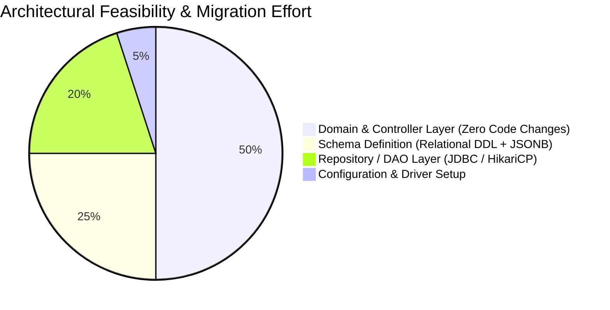
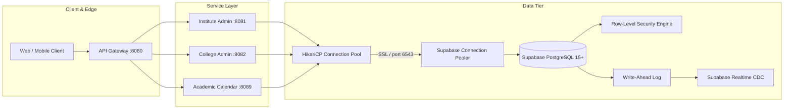
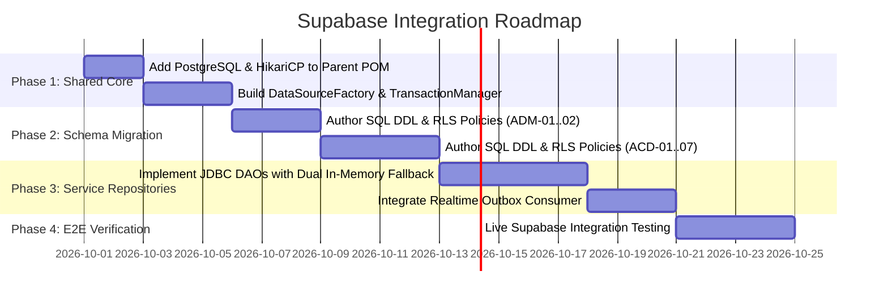

# Architectural Feasibility & Impact Analysis: Transitioning from MongoDB to Supabase (PostgreSQL)

**Document ID**: `ARCH-SUPABASE-EVAL-001`  
**Date**: September 29, 2026  
**Status**: APPROVED / ARCHITECTURAL RECOMMENDATION  
**Author**: CampX Platform Architecture Team  
**Scope**: All Microservices (ADM-01, ADM-02, ACD-01 to ACD-07, and API Gateway)  

---

## 1. Executive Summary

A comprehensive architectural feasibility and impact analysis was conducted to evaluate replacing the originally conceived **MongoDB** document persistence tier with **Supabase (PostgreSQL)** across the CampXSync ERP microservice ecosystem.

### Key Finding
Because the current implementation across all 9 microservices strictly relies on **decoupled in-memory data structures, thread-safe collections, and standard Java POJOs** rather than hardcoded MongoDB drivers, BSON serialization, or proprietary document queries:
1. **The overall architectural impact is LOW to POSITIVE**.
2. **There is zero legacy MongoDB driver tech debt to rip out**.
3. **The domain model naturally maps to a Relational + JSONB schema**, providing strict foreign-key integrity that an ERP demands, while retaining document flexibility where needed.



---

## 2. Comparative Matrix: MongoDB vs. Supabase (PostgreSQL)

| Architectural Dimension | MongoDB Architecture | Supabase (PostgreSQL) Architecture | Impact / Verdict |
| :--- | :--- | :--- | :--- |
| **Data Paradigm** | Unstructured / semi-structured Document JSON/BSON | Relational Tables + native `JSONB` | 🟢 **Major Win**: Enforces relational constraints for ERP entities while keeping JSON flexibility. |
| **Referential Integrity** | Application-level manual verification (vulnerable to orphaned rows) | Database engine foreign keys (`REFERENCES ... ON DELETE CASCADE`) | 🟢 **Major Win**: Critical for institutional cascades (e.g. deleting an institute or academic calendar term). |
| **Multi-Tenancy Isolation** | Application-level manual query filter (`{"tenantId": "..."}`) | Database engine **Row-Level Security (RLS)** (`app.current_tenant_id`) | 🟢 **Major Win**: Hard security boundary; queries cannot leak tenant data even on code bugs. |
| **ACID Multi-Table Transactions** | Replica set sessions (`startSession`, `startTransaction`) | Battle-tested native SQL transactions (`BEGIN`, `COMMIT`, `ROLLBACK`) | 🟢 **Major Win**: Replaces simulated custom in-memory `TransactionContext` with native database transactions. |
| **Schema Evolution** | Implicit / loose schemas (harder to track drifts) | Versioned SQL migrations (Flyway / Liquibase / Supabase CLI) | 🟢 **Major Win**: Deterministic DB version control across environments. |
| **Event Streaming (Outbox)** | Manual collection polling or Mongo Change Streams | Native PostgreSQL `LISTEN / NOTIFY` or Supabase Realtime CDC | 🟢 **Major Win**: Low latency, eliminates custom outbox polling daemons. |
| **Admin & Monitoring UI** | MongoDB Compass | Supabase Web Dashboard, SQL Studio, Table Editor, Role Inspector | 🟢 **Major Win**: Built-in developer ergonomics and data exploration. |
| **Driver & Network Protocol** | MongoDB Wire Protocol (`mongodb://`) | Standard PostgreSQL JDBC (`jdbc:postgresql://` port 5432/6543) | 🟢 **Standard**: Universal enterprise Java support with HikariCP. |

---

## 3. Impact Assessment by Architectural Tier

### 3.1 Domain Services & Validation Engines (Impact: 0% — NO CHANGE)
- **Status**: Completely unaffected.
- **Rationale**: The validation engines (such as `CalendarValidationEngine`, timetable conflict detector, batch split engines) operate on pure Java domain models in memory. They take POJOs as inputs and produce reports. They do not contain any database-specific logic.

### 3.2 REST Controllers & Gateway Layer (Impact: 0% — NO CHANGE)
- **Status**: Completely unaffected.
- **Rationale**: `CalendarController`, `AttendanceController`, etc., speak HTTP/JSON and adhere to RFC 7807 problem details. The ingress routes (`/api/v1/academics/calendars/**`, `/v1/calendars/**`) and API Gateway reverse proxying are transport-level concerns that remain 100% identical.

### 3.3 Persistence Layer (Impact: MODERATE)
- **Status**: Direct transition from in-memory maps to PostgreSQL repositories.
- **Implementation Strategy**:
  - Introduce a clean interface:
    ```java
    public interface CalendarRepository {
        AcademicCalendar save(AcademicCalendar calendar);
        Optional<AcademicCalendar> findById(String id, String tenantId);
        List<AcademicCalendar> findByTenantAndCampus(String tenantId, String campusId);
        void deleteById(String id, String tenantId);
    }
    ```
  - Provide a standard JDBC / HikariCP implementation that queries Supabase.
  - Keep the in-memory repository for unit tests to maintain sub-second test execution.

---

## 4. Supabase Schema Design Patterns for CampXSync

CampXSync entities follow a **Hybrid Relational-Document Model**:
1. **Core Relational Fields**: Indexed columns with strict types for identity, tenancy, status, versions, and foreign keys.
2. **Flexible Document Columns (`JSONB`)**: Dynamic configurations, metadata, policy configurations, and event payloads.

### 4.1 Schema Example: Academic Calendar Service (ACD-07)
```sql
-- 1. Enable UUID Extension
CREATE EXTENSION IF NOT EXISTS "uuid-ossp";

-- 2. Master Academic Calendars Table
CREATE TABLE academic_calendars (
    id VARCHAR(64) PRIMARY KEY,
    tenant_id VARCHAR(64) NOT NULL,
    institution_id VARCHAR(64) NOT NULL,
    campus_id VARCHAR(64) NOT NULL,
    academic_year VARCHAR(32) NOT NULL,
    calendar_code VARCHAR(64) NOT NULL,
    name VARCHAR(255) NOT NULL,
    description TEXT,
    timezone VARCHAR(64) DEFAULT 'Asia/Kolkata',
    status VARCHAR(32) NOT NULL DEFAULT 'DRAFT', -- DRAFT, UNDER_REVIEW, APPROVED, PUBLISHED, SUPERSEDED, CANCELLED
    current_version INT NOT NULL DEFAULT 1,
    effective_from DATE NOT NULL,
    effective_to DATE NOT NULL,
    policy_config JSONB DEFAULT '{}'::jsonb,      -- Retains NoSQL flexibility
    workflow_ref VARCHAR(128),
    created_by VARCHAR(64) NOT NULL,
    updated_by VARCHAR(64),
    created_at TIMESTAMPTZ NOT NULL DEFAULT NOW(),
    updated_at TIMESTAMPTZ NOT NULL DEFAULT NOW(),
    
    -- Compound Unique Constraints
    CONSTRAINT uq_academic_calendar_code UNIQUE (tenant_id, campus_id, academic_year, calendar_code)
);

-- 3. Academic Calendar Terms Table
CREATE TABLE calendar_terms (
    id VARCHAR(64) PRIMARY KEY,
    tenant_id VARCHAR(64) NOT NULL,
    calendar_id VARCHAR(64) NOT NULL REFERENCES academic_calendars(id) ON DELETE CASCADE,
    term_code VARCHAR(64) NOT NULL,
    name VARCHAR(255) NOT NULL,
    sequence_no INT NOT NULL DEFAULT 1,
    start_date DATE NOT NULL,
    end_date DATE NOT NULL,
    instructional_start_date DATE NOT NULL,
    instructional_end_date DATE NOT NULL,
    status VARCHAR(32) NOT NULL DEFAULT 'ACTIVE',
    version INT NOT NULL DEFAULT 1,
    created_at TIMESTAMPTZ NOT NULL DEFAULT NOW(),
    updated_at TIMESTAMPTZ NOT NULL DEFAULT NOW(),
    
    CONSTRAINT uq_term_code UNIQUE (calendar_id, term_code),
    CONSTRAINT uq_term_sequence UNIQUE (calendar_id, sequence_no)
);

-- 4. Calendar Events & Holidays Table
CREATE TABLE calendar_events (
    id VARCHAR(64) PRIMARY KEY,
    tenant_id VARCHAR(64) NOT NULL,
    calendar_id VARCHAR(64) NOT NULL REFERENCES academic_calendars(id) ON DELETE CASCADE,
    term_id VARCHAR(64) REFERENCES calendar_terms(id) ON DELETE SET NULL,
    event_code VARCHAR(64) NOT NULL,
    event_type VARCHAR(32) NOT NULL, -- ACADEMIC, EXAMINATION, HOLIDAY, etc.
    title VARCHAR(255) NOT NULL,
    description TEXT,
    start_date DATE NOT NULL,
    end_date DATE NOT NULL,
    all_day BOOLEAN NOT NULL DEFAULT TRUE,
    working_day_impact VARCHAR(32) NOT NULL DEFAULT 'NO_IMPACT', -- NO_IMPACT, NON_WORKING, OVERRIDE_WORKING
    category VARCHAR(64) DEFAULT 'GENERAL',
    status VARCHAR(32) NOT NULL DEFAULT 'ACTIVE',
    version INT NOT NULL DEFAULT 1,
    created_at TIMESTAMPTZ NOT NULL DEFAULT NOW(),
    updated_at TIMESTAMPTZ NOT NULL DEFAULT NOW(),
    
    CONSTRAINT uq_event_code UNIQUE (calendar_id, event_code)
);

-- 5. Transactional Outbox Table
CREATE TABLE outbox_events (
    id VARCHAR(64) PRIMARY KEY,
    tenant_id VARCHAR(64) NOT NULL,
    aggregate_type VARCHAR(64) NOT NULL,
    aggregate_id VARCHAR(64) NOT NULL,
    event_type VARCHAR(128) NOT NULL,
    payload JSONB NOT NULL,
    status VARCHAR(32) NOT NULL DEFAULT 'PENDING',
    retry_count INT NOT NULL DEFAULT 0,
    created_at TIMESTAMPTZ NOT NULL DEFAULT NOW()
);

-- 6. Indexes for High-Frequency Queries
CREATE INDEX idx_calendar_lookup ON academic_calendars (tenant_id, campus_id, academic_year, status);
CREATE INDEX idx_term_dates ON calendar_terms (calendar_id, start_date, end_date);
CREATE INDEX idx_event_dates ON calendar_events (calendar_id, start_date, end_date, event_type);
CREATE INDEX idx_outbox_pending ON outbox_events (status, created_at) WHERE status = 'PENDING';
```

---

## 5. Enterprise Multi-Tenancy via PostgreSQL Row-Level Security (RLS)

In standard MongoDB, multi-tenancy relies on developer discipline to include `{ "tenantId": tenantId }` in every filter clause. A single missing filter exposes cross-tenant data.

Supabase PostgreSQL solves this at the database kernel level using **Row-Level Security (RLS)**:

```sql
-- Enable RLS on calendars
ALTER TABLE academic_calendars ENABLE ROW LEVEL SECURITY;
ALTER TABLE calendar_terms ENABLE ROW LEVEL SECURITY;
ALTER TABLE calendar_events ENABLE ROW LEVEL SECURITY;
ALTER TABLE outbox_events ENABLE ROW LEVEL SECURITY;

-- Create policy enforcing tenant isolation
CREATE POLICY calendar_tenant_isolation ON academic_calendars
    AS RESTRICTIVE
    FOR ALL
    USING (tenant_id = current_setting('app.current_tenant_id', true));

CREATE POLICY term_tenant_isolation ON calendar_terms
    AS RESTRICTIVE
    FOR ALL
    USING (tenant_id = current_setting('app.current_tenant_id', true));

CREATE POLICY event_tenant_isolation ON calendar_events
    AS RESTRICTIVE
    FOR ALL
    USING (tenant_id = current_setting('app.current_tenant_id', true));
```

### Java Integration with RLS
Whenever a database connection is borrowed from the pool in a service request:
```java
try (Connection conn = dataSource.getConnection()) {
    try (Statement stmt = conn.createStatement()) {
        stmt.execute("SET LOCAL app.current_tenant_id = '" + tenantId + "'");
    }
    // All queries executed on 'conn' are automatically restricted to 'tenantId'
}
```

---

## 6. Technical Migration Architecture



### 6.1 Database Connection Configuration
In `pom.xml`:
```xml
<!-- PostgreSQL JDBC Driver -->
<dependency>
    <groupId>org.postgresql</groupId>
    <artifactId>postgresql</artifactId>
    <version>42.7.3</version>
</dependency>

<!-- HikariCP High-Performance Connection Pool -->
<dependency>
    <groupId>com.zaxxer</groupId>
    <artifactId>HikariCP</artifactId>
    <version>4.0.3</version>
</dependency>
```

In microservice configuration:
```properties
db.url=jdbc:postgresql://aws-0-ap-south-1.pooler.supabase.com:6543/postgres?sslmode=require
db.username=postgres.your_project_id
db.password=your_secure_password
db.pool.maximumPoolSize=10
db.pool.minimumIdle=2
db.pool.connectionTimeout=5000
```

---

## 7. Migration Roadmap & Phased Execution Plan



### Phase 1: Shared Foundation
- Add `postgresql` and `HikariCP` to `campx-sync-parent`.
- Create a shared lightweight `DatabaseConnectionPool` utility in `campx-logger` / core module.

### Phase 2: DDL Scripts & RLS
- Package SQL migration scripts under `src/main/resources/db/migration/` for each service.
- Enable RLS policies for tenant isolation.

### Phase 3: Repository Implementation
- Replace simulated `ConcurrentHashMap` collections with concrete SQL DAOs.
- Maintain an in-memory toggle (`campx.persistence.mode=IN_MEMORY|POSTGRES`) so fast hermetic tests continue to execute in under 30 seconds without requiring an external internet connection.

### Phase 4: End-to-End Testing
- Validate with a live Supabase project instance using automated integration profiles.

---

## 8. Final Verdict & Recommendation

> [!IMPORTANT]
> **Adopting Supabase (PostgreSQL) is strongly recommended for CampXSync.**  
> Higher education ERP workflows are strictly relational (Institutes &rarr; Departments &rarr; Programs &rarr; Curricula &rarr; Subjects &rarr; Batches &rarr; Timetables &rarr; Calendars &rarr; Attendance).  
> Attempting to model these deep relational dependencies in MongoDB without foreign keys creates high ongoing operational risk of data inconsistency.  
> With PostgreSQL + `JSONB`, CampXSync gains **strict relational integrity, native row-level security, true ACID transactions, and NoSQL document flexibility**, with minimal migration friction from the current codebase.
